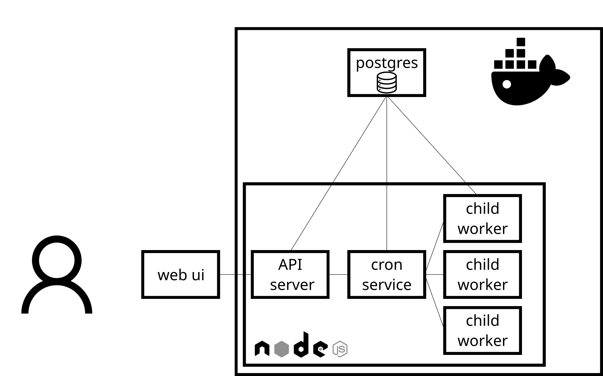
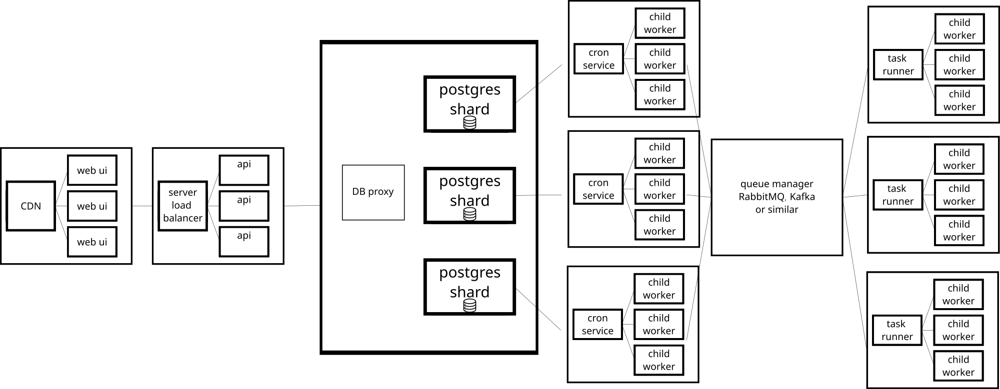

# Design document

# Cost efficiency

Search in DB is done via indexing with the b-tree algorithm on the `nextRunTime` field which is searched with the order which is O(log n).

Hardware-demanding parts of the system could be rewritten with a lower-level programming language like Rust, GO, or C.

Each record is saved one by one into DB, which could be optimized to bulk import, but the requirement was to make it reliable so there are always tradeoffs. On a scale, it will be done through queue managers.

On a scale system needs to be tested with inspection tools for optimization.

# Scaling

The solution was tested with 60K simultaneous tasks on my laptop(i5 11gen), up to 100 K this solution should work without issue with vertical scaling.

The application by default is vertically scalable as the number of workers is dependent on the number of tasks it needs to run.

To make it horizontally scalable I would cut the worker into a separate service and run it with other sharding DB for example. See the diagrams below,

## Current System components

Current system diagram

TS everywhere

1. UI with React
2. Server in node
   1. Workers for cron jobs
3. Postgres for data storage

Each component is wrapped into a docker container, orchestrated with docker-compose.

## Scaled up version 

In the scaled-up version, we would have a Queueing system to make sure no tasks are lost, CDN for frontend and load balancer for the backend, DB proxy to manage sharding DBs.

# What if it fails

Currently, every component is stateless except the database. On failure, each component of the system will restart. For example in the case of cron service will pick up wherever it is left and will continue processing tasks.

At scale, it should be done the same way + using a queueing mechanism. 
Sharding database solutions will cover one for another.

## What else could be done

We could

1. Bulk inserts on the update, to not save each record one by one, but this solution is elegant and I was not given a benchmark.
2. Set up an elastic search cluster for logs with Logstash
3. Set up swarm/k8s solution to make it multiserver/scalable
4. Rewrite the application with Rust, GO, or C
5. On bombard, insert bulk instead of individually.